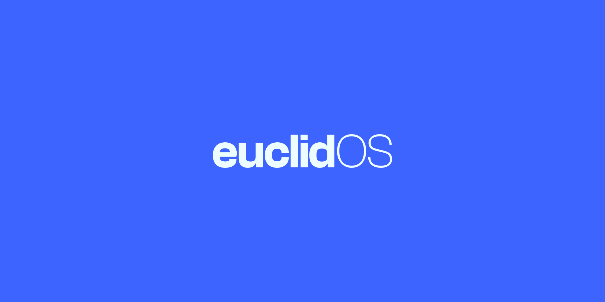

<a href="#"></a>
# euclidOS | Android Open Source Software

# Getting Started
---------------
To get started with the EuclidOS sources, you'll need to get
familiar with [Git and Repo](https://source.android.com/setup/build/downloading).

### Requirements
- Around 500GB disk space.
- Around 32GB RAM running Linux.

### Sync our source ###

```bash
repo init -u https://github.com/euclidOS-AOSP/manifest.git -b 16.1 --git-lfs
```
```bash
repo sync -c -j$(nproc --all) --force-sync --no-clone-bundle --no-tags --optimized-fetch --prune
```

Building the Source
-------------------
- Set up the build environment
```bash
. build/envsetup.sh
```

- Lunch the target
```bash
lunch euclid_$device-bp3a-userdebug
```

Start compilation
```bash
m euclid
```
